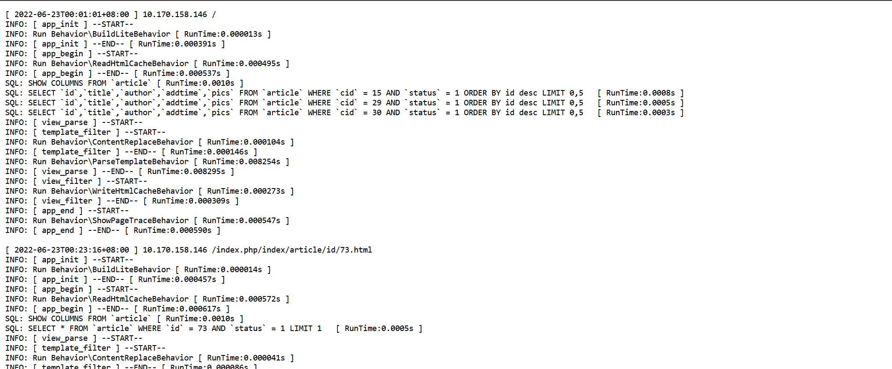

### 0x01 工具简述
本工具是根据网上公开的thinkphp 3.x日志泄露信息进行编写的。
参考博客文章:<br>
<a href='https://blog.csdn.net/weixin_40412037/article/details/113885372' target='_blank'>ThinkPHP 日志信息泄露——漏洞复现</a>
<hr>
主要就是对以下两个目录进行日志文件的扫描探测:

* thinkphp 3.1 默认日志文件目录 /Runtime/Logs/Home/
* thinkphp 3.2 默认日志文件目录 /Application/Runtime/Logs/Home/

日志文件的命名格式是 22_01_12.log，也就是年份_月份_日期.log的命名规则，所以就可以根据这个命名规则随机生成一个日志文件去探测目标是否存在日志泄露的问题。
<hr>
如果觉得本工具对您有帮助的话，请给我一个🌟呀！您的支持是我更新的最大动力🚀🚀🚀！！！

### 0x02 安装使用
#### 1.安装依赖项
```
pip install -r requirement.txt
```
#### 2.相关命令参数的说明
```
 -h, --help            show this help message and exit
  -u TARGET, --url TARGET
                        The target url
  -sY SYEAR, --start-year SYEAR
                        The year the scan began. Default: 22.
  -eY EYEAR, --end-year EYEAR
                        The year the scan end. Default: 23.
  -t THREAD_COUNT, --thread THREAD_COUNT
                        The number of threads.Default value is 10
  -f SCAN_FILE, --file SCAN_FILE
                        The target list file.
  --proxy PROXY         The setting of proxy. Example: http://127.0.0.1:31120
  -o OUTFILE, --outfile OUTFILE
                        The file location where the results are saved.Default
                        value is vuln.txt
```
其实我都已经默认配置好所需的参数了，您只需要将需要检测的url复制到urls.txt文件中，直接执行:
```
python thinkphp_log_scanner.py
```
即可自动进行批量检测目标是否存在日志泄露。当然，您也可以自定义参数的值进行扫描。
#### 3.资产搜索
FOFA搜索语句
```
app="thinkphp"
```

### 0x03 工具演示
#### 批量检测



#### 结果默认保存到vuln.txt中


### 0x04 修复建议
本漏洞产生的原因主要是配置不当，所以配置一下apache的访问控制文件，禁止访问*.log文件即可.

### 0x05 写在最后
本工具仅作为安全学习研究和合法的授权渗透测试，请不要使用本工具进行未授权渗透测试！<br>
使用本工具请遵守当地的法律！！！